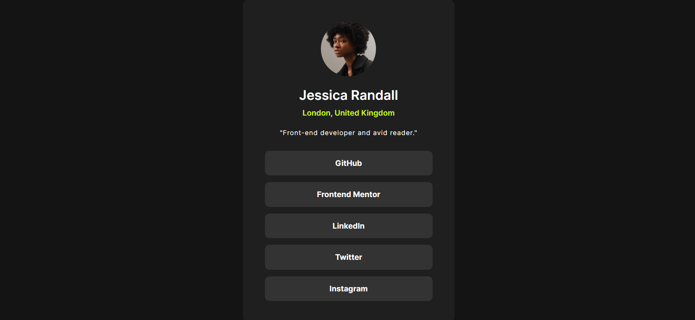

# Frontend Mentor - Social links profile solution

This is a solution to the [Social links profile challenge on Frontend Mentor](https://www.frontendmentor.io/challenges/social-links-profile-UG32l9m6dQ). Frontend Mentor challenges help you improve your coding skills by building realistic projects.

## Table of contents

- [Overview](#overview)
  - [The challenge](#the-challenge)
  - [Screenshot](#screenshot)
  - [Links](#links)
- [My process](#my-process)
  - [Built with](#built-with)
  - [What I learned](#what-i-learned)
  - [Continued development](#continued-development)
  - [Useful resources](#useful-resources)
- [Author](#author)

## Overview

### The challenge

Users should be able to:

- See hover and focus states for all interactive elements on the page

### Screenshot

### Links

- Solution URL: [ solution URL ](https://your-solution-url.com)
- Live Site URL: [ live site URL ](https://your-live-site-url.com)

## My process

### Built with

- Semantic HTML5 markup
- CSS custom properties
- Flexbox
- CSS Grid
- Mobile-first workflow

### What I learned

I learned how to make website just use a jpg design without figma file design

### Continued development

- Using a CSS Framework like Tailwind

### Useful resources

- [W3 Scholls](https://www.w3schools.com/css/css3_fonts.asp) - Import font css

## Author

- GitHub - [ArrifUber](https://github.com/ArrifUber)
- Frontend Mentor - [@ArrifUber](https://www.frontendmentor.io/profile/ArrifUber)
